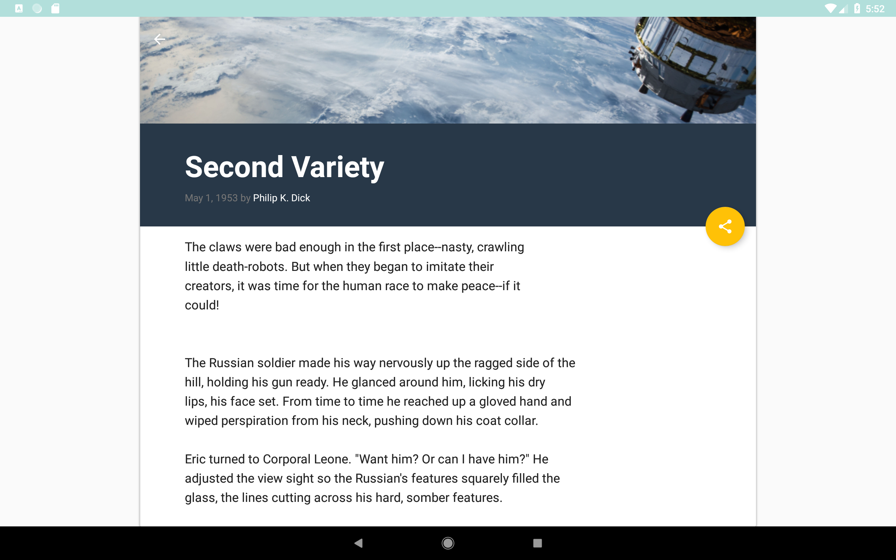

# XYZ Reader app

This repository stores the starter code for the XYZ Reader project in Udacity's Android Nanodegree.

This project gives the opportunity to improve an app’s design, a vital skill for building apps users will love. It also replicates a common developer task of updating and changing an app's design as new standards are released.

Through this project, I learnt to:
<ul>
<li>Understand the fundamentals of Android design.</li>
<li>Apply Material Design guidelines to an mobile application.</li>
<li>Separate an interface into surfaces.</li>
<li>Effectively use transitions and motion.</li></ul>

The app improved is XYZ Reader: A mock RSS feed reader featuring banner photos and headlines. The starter code can be found here: https://github.com/udacity/xyz-reader-starter-code
The app is currently functional, and work in most cases for most users. The improvements based on user feedback in the UI Review node and are improvements in UI in order to conform to Material Design.

User Feedback for XYZ Reader:
Lyla says:
“This app is starting to shape up but it feels a bit off in quite a few places. I can't put finger on it but it feels odd.”

Jay says:
“Is the text supposed to be so wonky and unreadable? It is not accessible to those of us without perfect vision."

Kagure says:
“The color scheme is really sad and I shouldn't feel sad.”

<h2> App's screenshots</h2>
<h3> Before (starter code)</h3>

   

<h3> After </h3>

      

 

